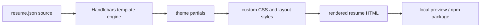

## Overview

A custom JSON Resume theme package built to keep the personal CV presentation polished, consistent, and easy to iterate on. The project focuses on turning a plain JSON Resume source into a more deliberate, branded presentation with reusable content structure and a visual layout that can evolve alongside the CV itself.

[JSON Resume](https://jsonresume.org/) is an open standard for resume data where content is stored as structured JSON. Its purpose is to separate resume content from presentation so the same source can be rendered across different themes, tools, and outputs.

This package extends the shared [`@wintermuted/ui-theme`](https://www.npmjs.com/package/@wintermuted/ui-theme) design system so resume layouts inherit the same foundational tokens and component styling used across Wintermuted properties.

### Featured capabilities

- Stronger section hierarchy for summaries, experience, projects, and skills
- Cleaner spacing and typography to make the resume feel more editorial and intentional
- Flexible project presentation that supports both work-related and open-source stories
- Local preview workflow driven by sample data so the theme can be refined quickly
- A publishable npm package that keeps the theme reusable across different resume renders

## Problem

A resume needs to feel intentional and cohesive, but default themes often leave too much to the defaults. I wanted a theme that matched the broader Wintermuted visual language while remaining straightforward to render and maintain.

## What I Built

I created a reusable theme package with custom Handlebars partials, stylesheet refinements, and a lightweight local preview workflow so the CV could be revised quickly without sacrificing presentation quality.

## Technical Architecture

The theme is structured around the [JSON Resume project](https://jsonresume.org/), using its template model with section-specific partials and CSS styling that can be published and consumed through npm. It extends [`@wintermuted/ui-theme`](https://www.npmjs.com/package/@wintermuted/ui-theme) for shared visual tokens and baseline component styles.

The rendering flow begins with the JSON Resume source, passes through Handlebars partials that shape the content, and finishes with a theme-specific stylesheet that controls the visual presentation.

## Outcomes

The result is a more polished, maintainable personal resume experience that can evolve from the same source of truth as the CV content itself.
