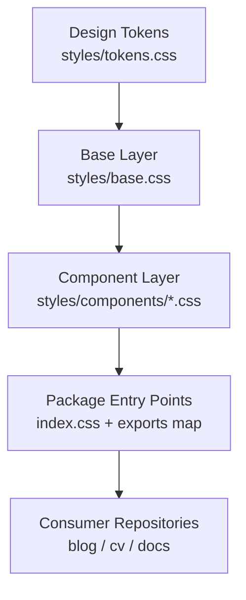
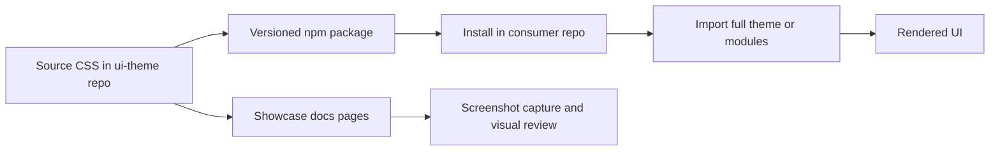
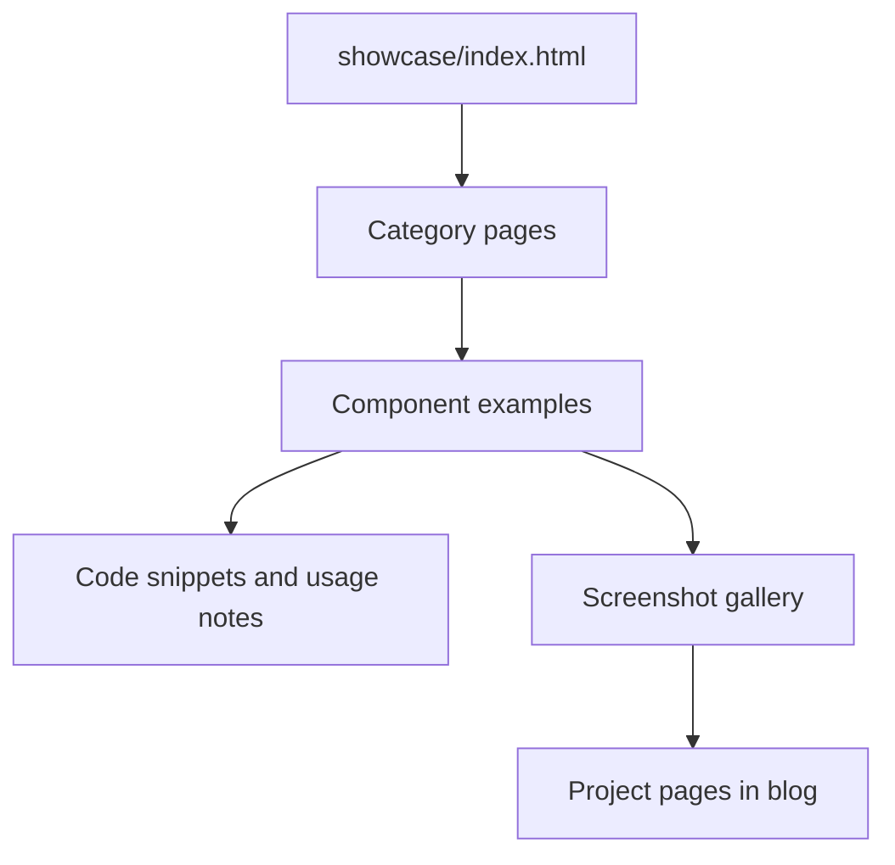

## Overview

A shared CSS and JavaScript design system package that standardizes visual language across Wintermuted projects. The package provides design tokens, base resets, and component styles that can be consumed as a full theme or as modular CSS entry points.

The goal is to keep UI quality consistent while reducing styling drift between repositories such as the blog, CV, and supporting documentation sites.

## Problem

Before this package, each project maintained small, divergent CSS stacks. That created three recurring problems:

- UI inconsistencies in spacing, color usage, and component states between projects.
- Slower iteration because visual fixes had to be reimplemented in multiple repos.
- Harder maintenance when accessibility or theming improvements needed coordinated updates.

The design-system package addressed this by centralizing the primitives and publishing them as a reusable dependency.

## What I Built

I built a package-first theme system with a static docs surface for validation and onboarding.

### Core package scope

- Design tokens in CSS custom properties for color, text hierarchy, spacing, radius, and shadows.
- Base element styles for typography and form defaults.
- Reusable components for cards, buttons, badges, tags, side navigation, code blocks, gallery patterns, and supporting layout primitives.
- Light and dark theme support via the `data-theme` attribute.

### Consumption model

- Full import: one-line import for fast adoption.
- Modular imports: selective component CSS for narrow use cases.
- Local linking workflow for testing changes in consumer repos before publishing.

### Documentation workflow

- Multi-page static docs in `showcase/` for component-specific examples.
- Real screenshot gallery used by this project page to document current visual states.
- Local server workflow for rapid review and capture updates.

## Current Implementation Scope

Today the package is optimized for static and app-shell style interfaces where consistent tokens and lightweight component classes are more important than framework-specific abstractions.

The strongest current coverage areas are:

- Documentation and content-heavy pages (cards, typography, navigation).
- Data presentation patterns (tables, chart wrappers, gallery tiles).
- Form controls and status messaging for operational UIs.

## Integration Workflow

Typical adoption flow in a consumer app:

1. Install `@wintermuted/ui-theme`.
2. Import the full bundle (or selected module files) at the app entry point.
3. Apply `wm-` component classes in templates and map app-specific selectors to theme tokens.
4. Validate light/dark appearance and interaction states in local preview.
5. Capture screenshots and update docs when component behavior changes.

## Technical Architecture

The architecture is split into three layers: token foundation, component styling, and distribution/validation workflows.

Tokens are the single source of visual truth. Base styles provide predictable defaults, and component styles compose on top without requiring framework-specific runtime code.

### Build and distribution model

This keeps publishing lightweight while still supporting visual QA through the showcase.

### Documentation architecture

The docs are intentionally static so they can run locally without build complexity and publish cleanly to GitHub Pages.

## Key Decisions

- CSS-first implementation over JS-heavy component runtime: Keeps footprint low and compatibility broad across static and framework-driven apps.
- Token-driven theming with `data-theme` switching: Enables consistent dark mode behavior without duplicating component definitions.
- Multi-page documentation instead of a single long showcase: Improves discoverability, QA focus, and screenshot maintenance.
- Local linking workflow for dependent repos: Enables fast integration testing before publishing package updates.

## Challenges

The main challenge was balancing consistency with flexibility. Consumer projects needed a stable visual baseline, but still required room for project-specific layout behavior.

Other recurring challenges included:

- Preventing style leakage between component classes.
- Keeping docs examples realistic enough to validate true usage patterns.
- Synchronizing screenshot updates across the docs repo and project pages.

## Outcomes

The package now serves as a shared UI foundation for Wintermuted projects and has reduced visual divergence across repos.

Observed impact so far:

- Faster UI iteration due to reusable component patterns.
- Cleaner onboarding for new pages using docs-backed examples.
- Improved consistency in dark/light theming behavior.
- Better architecture communication via diagram-backed documentation.
